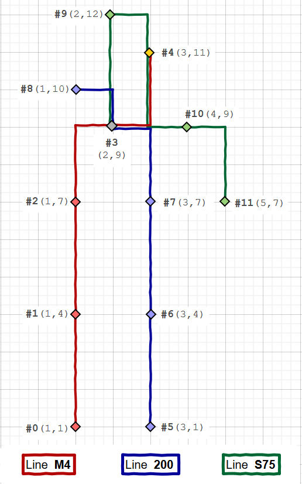

# verspaetung-transport-app
Very simple demo app, exposing a public transport RESTful API, 
related to a fictional city called `Verspaetung`.

> Verspaetung Transport Lines Coordinate Map

## Build Tools & Tech
- mvn 3+
- Java 11
- Lombok
- SpringBoot 2
- jUnit 5

#### Commands
- build project
    - `$ ./mvnw clean verify`
- run app
    - `$ ./mvnw clean package -D skipTests -P run`
    - main class: `com.github.catalin.cretu.verspaetung.App`

## Features
- find a vehicle by line name
- find the next arriving vehicle by stop ID
- find a vehicle by time and coordinates
- vehicle details
    - ID 
	- line
		- name
		- ID
	    - delay amount (in minutes)
	- next stop
		- ID
		- x, y coordinates
	    - normal arrival time

#### Endpoints
- artifact info
    - http://localhost:8081/actuator/info
- H2 database console
    - http://localhost:8081/h2-console
	- driver: `org.h2.Driver`
	- url: `jdbc:h2:<full root path>/verspaetung-transport-app/data/app`
	- user: `user`
	- password: `pass`
- all vehicles             
	- http://localhost:8081/api/vehicles
- vehicle by line name
	- http://localhost:8081/api/vehicles?lineName=M4
- vehicle by arrival time & stop coordinates
	- http://localhost:8081/api/vehicles?time=(time)&stopX=(xCoord)&stopY=(yCoord)
	- time format: `HHmmss`
- next vehicle at stop by stop ID
	- http://localhost:8081/api/vehicles?stopId=(stopId)

##### License
[Apache License 2.0](http://www.apache.org/licenses/LICENSE-2.0)